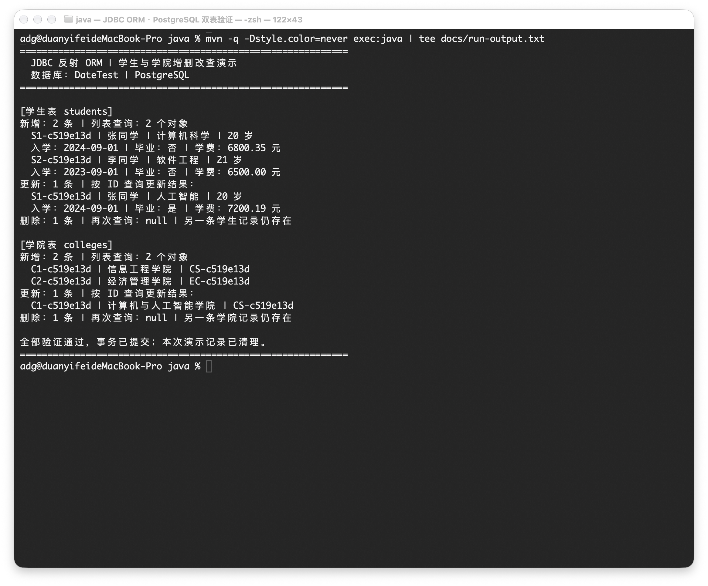

# JDBC 反射 ORM 练习

通过 Java 反射读取实体的表名、字段和主键映射，使用 JDBC 实现通用增删改查。数据库使用 PostgreSQL，演示对象为学生和学院。

仓库地址：https://github.com/duanzong007/jdbc-orm-assignment

## 运行环境

- JDK 17 或以上
- Maven 3.9 或以上
- PostgreSQL，数据库名称为 `DateTest`

本地验证使用 JDK 26、Maven 3.9.16、PostgreSQL 18.6，编译目标为 Java 17。

## 初始化数据库

本机 PostgreSQL 允许当前系统用户连接时，在项目根目录执行：

```sh
psql -d postgres -v ON_ERROR_STOP=1 -f sql/create-database.sql
psql -d DateTest -v ON_ERROR_STOP=1 -f sql/schema.sql
```

如果需要指定数据库用户，可以给两个命令添加 `-h localhost -U 用户名`。`create-database.sql` 使用 psql 的 `\gexec` 命令，只在数据库不存在时创建；`schema.sql` 创建学生表和学院表，不清空已有数据。

PostgreSQL 会将未加引号的标识符转为小写，因此创建数据库时使用了 `"DateTest"`，连接地址也保留相同大小写。

## 配置连接

默认配置位于 `src/main/resources/database.properties`：

```properties
# 默认连接本机，用户名为空时使用当前系统用户名。
db.url=jdbc:postgresql://localhost:5432/DateTest
db.user=
db.password=
```

环境变量优先于配置文件。需要账号密码时，可以在当前终端设置：

```sh
# 按自己的数据库环境填写，不需要修改或提交密码配置。
export DB_URL='jdbc:postgresql://localhost:5432/DateTest'
export DB_USER='postgres'
export DB_PASSWORD='自己的数据库密码'
```

执行 SQL 初始化时使用的是 psql 的连接配置；上面的 `DB_*` 变量用于 Java 程序和测试。

## 构建与演示

```sh
# 需要先初始化数据库；测试会连接真实的 PostgreSQL。
mvn clean verify

# 运行学生、学院两张表的增删改查演示。
mvn -q exec:java
```

程序分别插入两条学生记录和两条学院记录，查询对象列表，按主键更新并查询单个对象，再删除并确认查询结果为 `null`，同时检查另一条记录仍然存在。

演示只操作本次随机生成主键的记录，成功后会清理演示数据并提交事务；失败时回滚。运行完后表中不会保留这次演示的数据。

## 数据表与实体

| 表 | Java 实体 | 字段 |
| --- | --- | --- |
| `students` | `Student` | `id`、`name`、`major`、`age`、`enrollment_date`、`graduated`、`tuition` |
| `colleges` | `College` | `id`、`name`、`code` |

主键采用调用方赋值的 `String`；入学时间使用 `LocalDate` 对应 `DATE`，毕业状态使用 `Boolean` 对应 `BOOLEAN`，学费用 `BigDecimal` 对应 `NUMERIC(12,2)`。允许为空的字段使用包装类型。

`@Table` 指定表名，`@Column` 指定列名，`@Id` 标记主键。工具类读取这些注解后生成 SQL，无需针对学生和学院分别编写增删改查方法。

## 工具类方法

| 方法 | 作用和返回值 |
| --- | --- |
| `resultSetToList(ResultSet, Class<T>)` | 使用无参构造方法创建对象，再通过反射赋值；没有记录时返回空列表 |
| `save(T, Connection)` | 保存对象的全部映射字段，返回插入行数 |
| `update(T, Connection)` | 按主键更新其余字段，返回更新行数，不存在时为 `0` |
| `delete(T, Connection)` | 按主键删除，返回删除行数，不存在时为 `0` |
| `getOneById(String, Class<T>, Connection)` | 按主键查询，不存在时返回 `null` |
| `queryList(String, Class<T>, Connection, Object...)` | 执行带参数的查询并转换成对象列表 |

实体需要无参构造方法和一个字符串主键，目前映射的是实体自身声明的字段。查询列名或别名需要与 `@Column` 对应，未知列及重复列会报错；未查询的字段保留默认值。

表名和列名经过检查，字段值使用 `PreparedStatement` 的占位符绑定。数据库异常封装为 `OrmException`，原始原因可以通过 `getCause()` 查看。

工具类关闭自己创建的语句和结果集；传入的 `Connection` 和 `resultSetToList` 使用的 `ResultSet` 由调用方关闭。工具类不提交事务，也不回滚事务。

## 验证与运行结果

10 项测试均通过，覆盖真实数据库连接、非法映射、多行和空值转换、日期与精确金额、双表保存更新删除、带引号文本、主键参数绑定及调用方事务回滚。测试数据在各测试结束后回滚。

- [终端运行截图](docs/运行效果.png)


